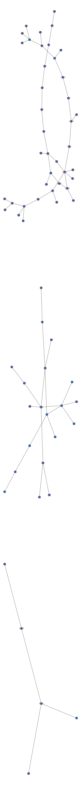
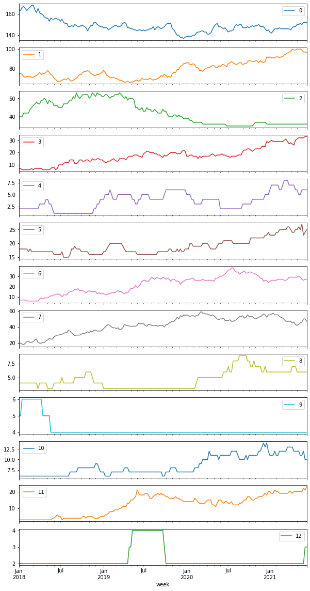

# 3.2 Задача о штате IT-компании


```python
import sqlite3
import pandas as pd
import numpy as np
from collections import defaultdict
import numpy as np
import networkx as nx
import matplotlib.pyplot as plt
```


```python

cnx = sqlite3.connect('employee.db')

df = pd.read_sql_query("SELECT * from employees;", cnx)

```


```python
df.head()
```


<div>
<style scoped>
    .dataframe tbody tr th:only-of-type {
        vertical-align: middle;
    }

    .dataframe tbody tr th {
        vertical-align: top;
    }

    .dataframe thead th {
        text-align: right;
    }
</style>
<table border="1" class="dataframe">
  <thead>
    <tr style="text-align: right;">
      <th></th>
      <th>id</th>
      <th>name</th>
      <th>boss_id</th>
    </tr>
  </thead>
  <tbody>
    <tr>
      <th>0</th>
      <td>1</td>
      <td>Rebecca Slaughter</td>
      <td>NaN</td>
    </tr>
    <tr>
      <th>1</th>
      <td>2</td>
      <td>Brian Hudson</td>
      <td>NaN</td>
    </tr>
    <tr>
      <th>2</th>
      <td>3</td>
      <td>Charles Fillmore</td>
      <td>NaN</td>
    </tr>
    <tr>
      <th>3</th>
      <td>4</td>
      <td>Toby Spaulding</td>
      <td>NaN</td>
    </tr>
    <tr>
      <th>4</th>
      <td>5</td>
      <td>Orlando Mays</td>
      <td>NaN</td>
    </tr>
  </tbody>
</table>
</div>


```python
def parse_events(filename):
    with open(filename,'r') as f:
        lines = f.read().splitlines()
    result = []
    temp= []
    for i in range(1,len(lines)):
        line = lines[i] 
        if line == '---':
            result.append(temp)
            temp = []
            continue
        elif line == '':
            continue
        elif line.startswith('Name:'):
            line = line[len('Name:'):].strip()
        elif line.startswith('Date:'):
            line = line[len('Date:'):].strip()
        elif line.startswith('Boss:'):
            line = line[len('Boss:'):].strip()
            
            
        temp.append(line)
    result.append(temp)
    return result
```


```python
events = pd.DataFrame(parse_events('events.txt'))
events.columns = ['name','date','event','boss']
events['dateStr'] = events['date']
events['date'] = pd.to_datetime(events['date'])
```


```python
events['event'].unique()
```


    array(['Transfer', 'Hire', 'Fire'], dtype=object)


```python
for event in ['Fire','Hire','Transfer']:
    print(events[events['event']==event].head(1))
```

                 name       date event  boss     dateStr
    4  Karen Spannaus 2018-01-03  Fire  None  2018-01-03
                name       date event           boss     dateStr
    2  Orpha Gilmore 2018-01-01  Hire  Bradley Dirks  2018-01-01
                  name       date     event             boss     dateStr
    0  Carolyn Johnson 2018-01-01  Transfer  Geoffrey Larsen  2018-01-01


Смотрим пропуски


```python
df.isna().sum()
```


    id          0
    name        0
    boss_id    10
    dtype: int64


10 пропусков в boss_id - записи руководителей


```python
set(events.name.unique())-set(df.name.unique())
```


    set()


```python
set(df.name.unique()) - set(events.name.unique())
```


    {'Brian Hudson',
     'Charles Fillmore',
     'David Lee',
     'Donna Cranker',
     'Geoffrey Larsen',
     'Michael Teixeira',
     'Orlando Mays',
     'Oscar Tharp',
     'Rebecca Slaughter',
     'Toby Spaulding'}


Проверяем, что множество name из df содержат все варианты name из таблицы events

## Строим и анализируем граф


```python
def build_graph():
    g = nx.Graph()
    for i,row in df.iterrows():
        id_ = row['id']
        boss_id = row['boss_id']
        if pd.isna(boss_id):
            continue
        g.add_edge(id_, boss_id)
    return g

```


```python
G = build_graph()
```


```python
len(list(nx.connected_components(G)))
```


    13


Графов больше чем руководителей отделов, посмотрим на графы без руководителей 


```python
boss_ids = set(i for i in range(1,11))
to_draw = []
for c in components:
    if c & boss_ids:
        continue
    to_draw.append(c)

    
fig, axes = plt.subplots(len(to_draw),1,figsize=(10,100), dpi=100)
components = list(nx.connected_components(G))    

for i in range(len(to_draw)):
    ax = axes[i]
    tempg = G.subgraph(to_draw[i])
    nx.draw(tempg,ax=ax,with_labels = True,font_color='red')

```


    

    


```python
df[df.id.isin([215,220,146,160,79])]
```


<div>
<style scoped>
    .dataframe tbody tr th:only-of-type {
        vertical-align: middle;
    }

    .dataframe tbody tr th {
        vertical-align: top;
    }

    .dataframe thead th {
        text-align: right;
    }
</style>
<table border="1" class="dataframe">
  <thead>
    <tr style="text-align: right;">
      <th></th>
      <th>id</th>
      <th>name</th>
      <th>boss_id</th>
    </tr>
  </thead>
  <tbody>
    <tr>
      <th>78</th>
      <td>79</td>
      <td>Ralph Sikes</td>
      <td>215.0</td>
    </tr>
    <tr>
      <th>145</th>
      <td>146</td>
      <td>Rudy Harris</td>
      <td>146.0</td>
    </tr>
    <tr>
      <th>159</th>
      <td>160</td>
      <td>Patricia Moore</td>
      <td>146.0</td>
    </tr>
    <tr>
      <th>214</th>
      <td>215</td>
      <td>Robert Green</td>
      <td>146.0</td>
    </tr>
    <tr>
      <th>219</th>
      <td>220</td>
      <td>Charles Baldwin</td>
      <td>215.0</td>
    </tr>
  </tbody>
</table>
</div>


```python
df[df.id==df.boss_id]
```


<div>
<style scoped>
    .dataframe tbody tr th:only-of-type {
        vertical-align: middle;
    }

    .dataframe tbody tr th {
        vertical-align: top;
    }

    .dataframe thead th {
        text-align: right;
    }
</style>
<table border="1" class="dataframe">
  <thead>
    <tr style="text-align: right;">
      <th></th>
      <th>id</th>
      <th>name</th>
      <th>boss_id</th>
    </tr>
  </thead>
  <tbody>
    <tr>
      <th>145</th>
      <td>146</td>
      <td>Rudy Harris</td>
      <td>146.0</td>
    </tr>
  </tbody>
</table>
</div>


Похоже, что сотрудник сам себе босс и ему стоило занулить boss_id, больше таких сотрудников нет. Посмотрим на остальные графы. 


```python
df[df.id.isin([39,51,110,97])]
```


<div>
<style scoped>
    .dataframe tbody tr th:only-of-type {
        vertical-align: middle;
    }

    .dataframe tbody tr th {
        vertical-align: top;
    }

    .dataframe thead th {
        text-align: right;
    }
</style>
<table border="1" class="dataframe">
  <thead>
    <tr style="text-align: right;">
      <th></th>
      <th>id</th>
      <th>name</th>
      <th>boss_id</th>
    </tr>
  </thead>
  <tbody>
    <tr>
      <th>38</th>
      <td>39</td>
      <td>Mae Deardorff</td>
      <td>51.0</td>
    </tr>
    <tr>
      <th>50</th>
      <td>51</td>
      <td>Colleen Soto</td>
      <td>110.0</td>
    </tr>
    <tr>
      <th>96</th>
      <td>97</td>
      <td>Charles Brooks</td>
      <td>39.0</td>
    </tr>
    <tr>
      <th>109</th>
      <td>110</td>
      <td>Daniel Hagadone</td>
      <td>97.0</td>
    </tr>
  </tbody>
</table>
</div>


Видим цикл в графе, не понятно кто кем руководит.


```python
df[df.id.isin([301,279,255,203,345,161])]
```


<div>
<style scoped>
    .dataframe tbody tr th:only-of-type {
        vertical-align: middle;
    }

    .dataframe tbody tr th {
        vertical-align: top;
    }

    .dataframe thead th {
        text-align: right;
    }
</style>
<table border="1" class="dataframe">
  <thead>
    <tr style="text-align: right;">
      <th></th>
      <th>id</th>
      <th>name</th>
      <th>boss_id</th>
    </tr>
  </thead>
  <tbody>
    <tr>
      <th>160</th>
      <td>161</td>
      <td>Gregory Ruybal</td>
      <td>301.0</td>
    </tr>
    <tr>
      <th>202</th>
      <td>203</td>
      <td>Alicia Viviano</td>
      <td>345.0</td>
    </tr>
    <tr>
      <th>254</th>
      <td>255</td>
      <td>Mary Williams</td>
      <td>203.0</td>
    </tr>
    <tr>
      <th>278</th>
      <td>279</td>
      <td>Sheena Counter</td>
      <td>255.0</td>
    </tr>
    <tr>
      <th>300</th>
      <td>301</td>
      <td>Joann Weaver</td>
      <td>279.0</td>
    </tr>
    <tr>
      <th>344</th>
      <td>345</td>
      <td>David Drage</td>
      <td>161.0</td>
    </tr>
  </tbody>
</table>
</div>


Видим цикл в графе, не понятно кто кем руководит.

## Построим график


```python
components = list(nx.connected_components(G)) 

name_id_map = {row['name']:row['id'] for i,row in df.iterrows()}
emp_id_boss_id_map = {row['id']: row['boss_id'] for i,row in df.iterrows()}


flags = {}
department_emp_num = defaultdict(int)

for i,dep in enumerate(components):
    for item in dep:
        flags[item] = i
    department_emp_num[i] = len(dep)
        
```


```python
from copy import copy

def hire(p,c):
    flag = flags[p]
    flags[c] =  flag
    department_emp_num[flag]+=1
    name_id_map[name] = emp_id
    emp_id_boss_id_map[emp_id] = boss_id
    
def fire(p,c):
    flag = flags[c]
    del flags[c]
    department_emp_num[flag]-=1
    
def transfer(oldp,newp,c):
    old_flag = flags[c]
    new_flag = flags[newp]
    if old_flag != new_flag:
        flags[c] = new_flag
        department_emp_num[old_flag]-=1
        department_emp_num[new_flag]+=1

result = {}
id_count = df.shape[0]
for i,item in events.sort_values(by='date').iterrows():
    event = item['event']
    name  = item['name']
    boss = item['boss']
    if event == 'Hire':
        id_count+=1
        emp_id = id_count
        boss_id = name_id_map[boss]
        hire(boss_id,emp_id)
    elif event == 'Fire':
        emp_id = name_id_map[name]
        boss_id = emp_id_boss_id_map[emp_id]
        fire(boss_id,emp_id)
    elif event == 'Transfer':
        emp_id = name_id_map[name]
        new_boss_id = name_id_map[boss]
        old_boss_id = emp_id_boss_id_map[emp_id]
        transfer(old_boss_id,new_boss_id,emp_id)
        emp_id_boss_id_map[emp_id]=new_boss_id
    result[item['date']] = copy(department_emp_num)
```


```python
result = pd.DataFrame(result.values(),index=result.keys()).reset_index()
```


```python
result['week'] = result['index'].dt.to_period('W-MON')

```


```python
cleared_result = result.groupby('week').first().drop(columns=['index'])
```

## Итоговый график


```python
_ = cleared_result.plot(subplots=True,figsize=(10,20))
```


    

    

