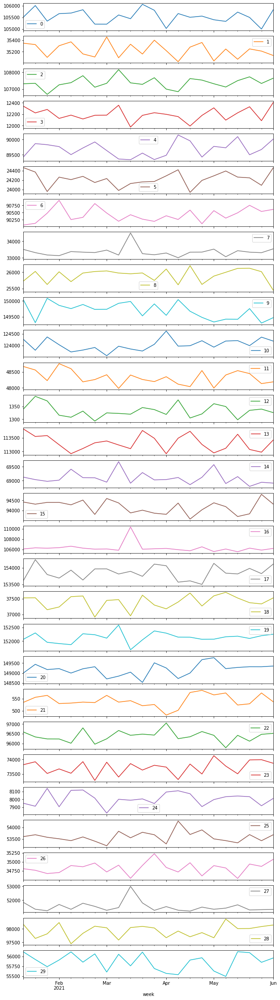
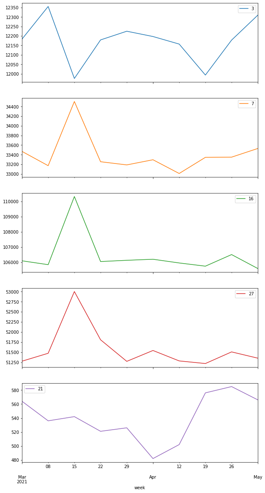
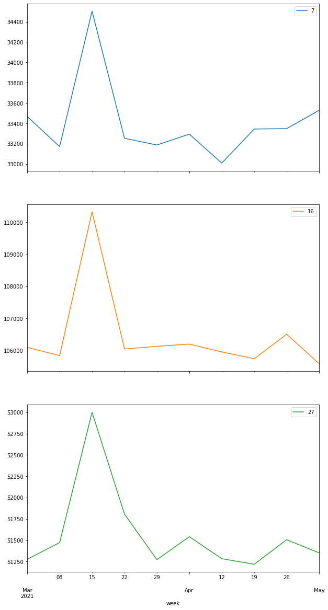
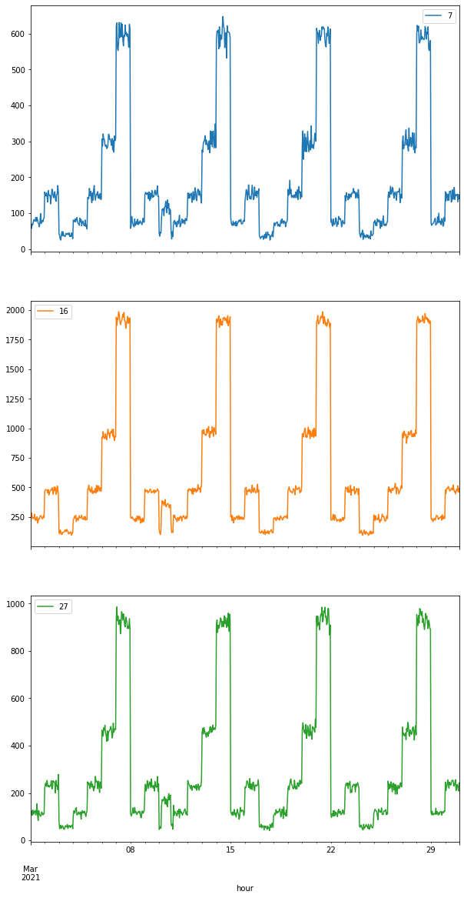
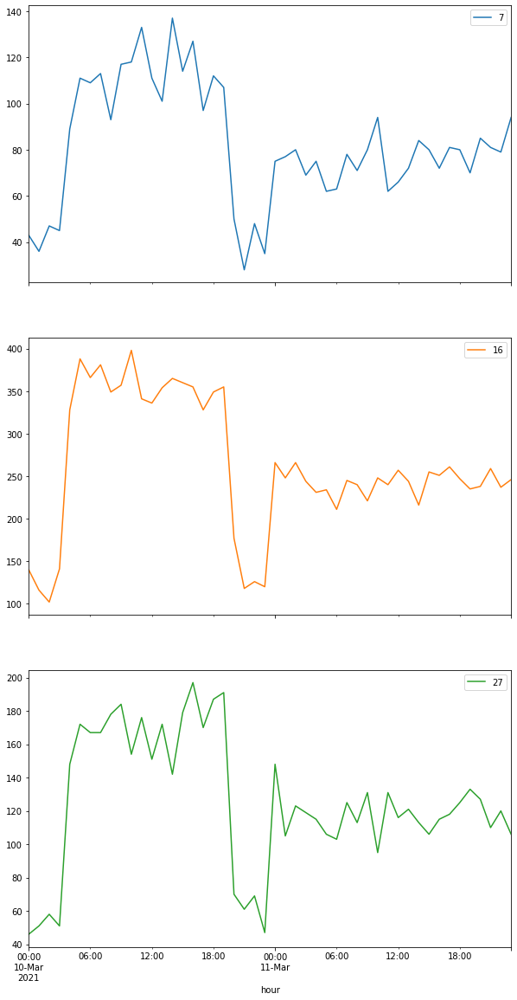
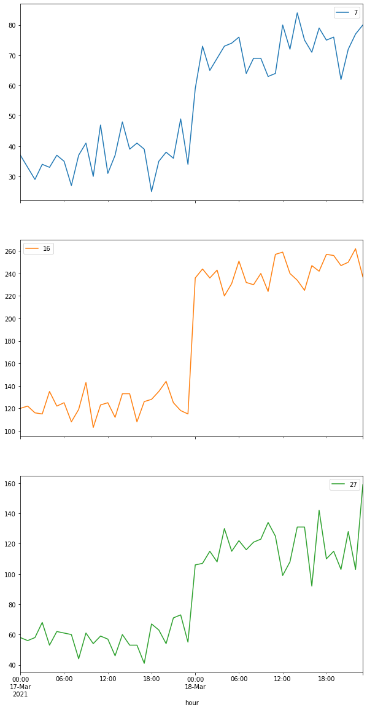

# 3.3 Задача о лишних транзакциях


```python
import pandas as pd
```


```python
df = pd.read_csv("txs.csv",header=None)
df.columns = ['timestamp','id']
df['timestamp'] =  pd.to_datetime(df.timestamp)
df['week'] = df.timestamp.dt.to_period('W-MON')

```


```python
groupped = df.groupby(['week','id']).timestamp.count()
groupped = groupped.reset_index().pivot(index='week', columns='id', values='timestamp')[1:-1]
```


```python
_=groupped.plot(subplots=True,figsize=(10,40))
```


    

    


Видны сильные отклонения на графиках 3,7,16,27,21 с марта по апрель


```python
selected = groupped[[3,7,16,27,21]].loc['2021-03':'2021-04']
_= selected.plot(subplots=True,figsize=(10,20))
```


    

    


```python
selected = groupped[[7,16,27]].loc['2021-03':'2021-04']
_= selected.plot(subplots=True,figsize=(10,20))
```


    

    


```python
groupped.describe()[[7,16,27]]
```


<div>
<style scoped>
    .dataframe tbody tr th:only-of-type {
        vertical-align: middle;
    }

    .dataframe tbody tr th {
        vertical-align: top;
    }

    .dataframe thead th {
        text-align: right;
    }
</style>
<table border="1" class="dataframe">
  <thead>
    <tr style="text-align: right;">
      <th>id</th>
      <th>7</th>
      <th>16</th>
      <th>27</th>
    </tr>
  </thead>
  <tbody>
    <tr>
      <th>count</th>
      <td>22.000000</td>
      <td>22.000000</td>
      <td>22.000000</td>
    </tr>
    <tr>
      <th>mean</th>
      <td>33364.272727</td>
      <td>106293.227273</td>
      <td>51529.227273</td>
    </tr>
    <tr>
      <th>std</th>
      <td>292.053841</td>
      <td>938.757838</td>
      <td>381.746355</td>
    </tr>
    <tr>
      <th>min</th>
      <td>33010.000000</td>
      <td>105563.000000</td>
      <td>51219.000000</td>
    </tr>
    <tr>
      <th>25%</th>
      <td>33204.500000</td>
      <td>105984.250000</td>
      <td>51307.500000</td>
    </tr>
    <tr>
      <th>50%</th>
      <td>33333.000000</td>
      <td>106119.500000</td>
      <td>51394.000000</td>
    </tr>
    <tr>
      <th>75%</th>
      <td>33420.750000</td>
      <td>106257.750000</td>
      <td>51643.250000</td>
    </tr>
    <tr>
      <th>max</th>
      <td>34504.000000</td>
      <td>110328.000000</td>
      <td>53001.000000</td>
    </tr>
  </tbody>
</table>
</div>


```python
selected_ids = df[df.id.isin([7,16,27])]
```


```python
selected_ids['hour'] = selected_ids.timestamp.dt.to_period('H')
selected_ids['day'] = selected_ids.timestamp.dt.to_period('D')
selected_ids['month/week'] = selected_ids.timestamp.dt.to_period('W-MON')
g_selected_ids = selected_ids.groupby(['id','hour']).count().reset_index().pivot(index='hour', columns='id', values='timestamp')
```

    <ipython-input-20-53809536cc59>:1: SettingWithCopyWarning: 
    A value is trying to be set on a copy of a slice from a DataFrame.
    Try using .loc[row_indexer,col_indexer] = value instead
    
    See the caveats in the documentation: https://pandas.pydata.org/pandas-docs/stable/user_guide/indexing.html#returning-a-view-versus-a-copy
      selected_ids['hour'] = selected_ids.timestamp.dt.to_period('H')
    <ipython-input-20-53809536cc59>:2: SettingWithCopyWarning: 
    A value is trying to be set on a copy of a slice from a DataFrame.
    Try using .loc[row_indexer,col_indexer] = value instead
    
    See the caveats in the documentation: https://pandas.pydata.org/pandas-docs/stable/user_guide/indexing.html#returning-a-view-versus-a-copy
      selected_ids['day'] = selected_ids.timestamp.dt.to_period('D')
    <ipython-input-20-53809536cc59>:3: SettingWithCopyWarning: 
    A value is trying to be set on a copy of a slice from a DataFrame.
    Try using .loc[row_indexer,col_indexer] = value instead
    
    See the caveats in the documentation: https://pandas.pydata.org/pandas-docs/stable/user_guide/indexing.html#returning-a-view-versus-a-copy
      selected_ids['month/week'] = selected_ids.timestamp.dt.to_period('W-MON')


```python
g_selected_ids = selected_ids.groupby(['id','hour']).count().reset_index().pivot(index='hour', columns='id', values='timestamp')
g_selected_ids.loc['2021-03-1':'2021-03-30'].plot(subplots=True,figsize=(10,20))

```


    array([<AxesSubplot:xlabel='hour'>, <AxesSubplot:xlabel='hour'>,
           <AxesSubplot:xlabel='hour'>], dtype=object)


    

    


Видна цикличность, на каждом графике есть отклонение между 2021-03-10 и 2021-03-11


```python
g_selected_ids.loc['2021-03-10':'2021-03-11'].plot(subplots=True,figsize=(10,20))

```


    array([<AxesSubplot:xlabel='hour'>, <AxesSubplot:xlabel='hour'>,
           <AxesSubplot:xlabel='hour'>], dtype=object)


    

    


Обычный день


```python
g_selected_ids = selected_ids.groupby(['id','hour']).count().reset_index().pivot(index='hour', columns='id', values='timestamp')
g_selected_ids.loc['2021-03-17':'2021-03-18'].plot(subplots=True,figsize=(10,20))
```


    array([<AxesSubplot:xlabel='hour'>, <AxesSubplot:xlabel='hour'>,
           <AxesSubplot:xlabel='hour'>], dtype=object)


    

    


## Ответ


Лишнии транзакции были у клиентов 7,16,27  
Время - в течении 10.03.21
